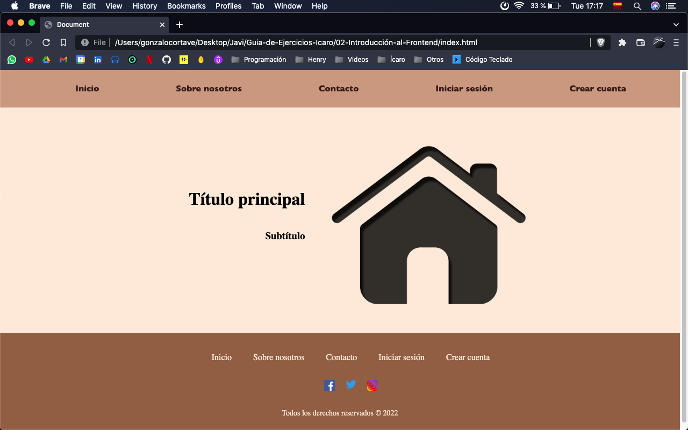

<h1>Introducción al Front-end</h1>

<h2>Consignas</h2>

La idea de estos ejercicios es ir armando de a poco una página con diferentes secciones.
<br>
Empezamos creando nuestro archivo "madre". Representará la página de inicio de nuestro proyecto. Lo llamaremos <strong><em>index.html</em></strong>.
<br>
Para empezar a escribir código HTML simplemente escribimos un signo de exclamación "<strong> ! </strong>" y esperamos que se abran las opciones de tipado rápido. Damos enter en la primer opción (debería decir "<em>Emmet Abbreviation</em>"). Nos debería aparecer el siguiente código:

```html
<!DOCTYPE html>
<html lang="en">
<head>
    <meta charset="UTF-8">
    <meta http-equiv="X-UA-Compatible" content="IE=edge">
    <meta name="viewport" content="width=device-width, initial-scale=1.0">
    <title>Document</title>
</head>
<body>
    
</body>
</html>
```

Dentro de las etiquetas <em>body</em> es donde vamos a crear la estructura de nuestras páginas, las cuales serán "Inicio" (archivo "index.html"), "Sobre nosotros" (archivo "about-us.html"), "Contacto" (archivo "contact.html"), "Iniciar sesión" (archivo "log-in.html") y "Crear cuenta" (archivo "sign-in.html").
<br>
Para nuestra página de inicio creamos una barra de navegación, que va a ser un

```html
<div>
```

con una lista no ordenada dentro. ¿Qué etiqueta sería correcto usar en lugar de un "div"? ¿Qué otra etiqueta habría que abrir antes de empezar la lista?
<br>
Cada ítem de la lista será un link que haga referencia al resto de las páginas. ¿Cómo le asigno un destino a un link?
<hr>
Luego vamos a crear lo que comunmente se denomina "Hero". La sección de una página que se encuentra arriba de todo y donde suele haber un título, un subtítulo y una imagen característica de la página. Nuestra página de inicio sólo va a contener esta información.
<hr>
Luego, en la parte de abajo de la página, vamos a crear el footer. ¿Hay alguna etiqueta HTML correcta para la creación de esta sección?
<br>
Dentro del footer vamos a tener, de nuevo, links al resto de las páginas y, también, links a lo que serían las redes sociales de nuestra marca. Para estos links, simplemente vamos a hacer que redirijan a las páginas de inicio de las redes (el botón de Facebook va a redirigir a "facebook.com" y así con las redes sociales que crean relevantes. No más de cinco).
<hr>
Llegó la hora de darle estilo a nuestra página, para que cada sección quede ordenada y estilizada a nuestro gusto. Para esto, vamos a crear un archivo llamado <strong>"style.css"</strong> y, en nuestro archivo <strogn>index.html</strong>, dentro de la etiqueta "head" agregamos el siguiente código:

```html
<link ref="stylesheet" href="style.css">
```

de manera que nuestro archivo "index.html" debería empezar de la siguiente manera:

```html
<!DOCTYPE html>
<html lang="en">
<head>
    <meta charset="UTF-8">
    <meta http-equiv="X-UA-Compatible" content="IE=edge">
    <meta name="viewport" content="width=device-width, initial-scale=1.0">
    <title>Document</title>
    <link rel="stylesheet" href="style.css">
</head>
```

Modificar el contenido de la etiqueta "title" para que, en la pestaña del navegador, figure el nombre de nuestra página.
<br>
Agregar, para los casos que hagan falta, <strong>clases</strong> a las distintas etiquetas HTML, para definir su estilo CSS. El resultado final de nuestra página de inicio debería ser como la siguiente imágen. Sientanse con libertad de modificar tamaños, colores, fuentes, alineaciones, márgenes y demás estilos. Agregar algún efecto de hover para los links.
<br>
<br>

<br>
<hr>
Una vez lista nuestra página de inicio vamos a crear las otras páginas, cada una en un archivo HTML distinto y con su respectivo archivo de estilos.
<br>
Crear una carpeta por cada página. Vamos a empezar por "Sobre nosotros". Para mantener cierto orden, la carpeta se va a llamar "About-us". Dentro de la carpeta creamos los archivos "about-us.html" y "about-us.css". Repetir estos pasos para el resto de las páginas.
<br>
Todas nuestras páginas van a tener una <strong>barra de navegación</strong> con links al resto de las páginas en la parte superior, y un <strong>footer</strong> igual al de la página de inicio en la parte inferior. Mantener el <strong>mismo estilo</strong> en cada página.
<br>
También, todas las páginas van a comenzar con un <strong>título</strong> acorde a la página.
<hr>
La página "Sobre nosotros" va a contener <strong>tres artículos</strong> con sus respectivos títulos. Respetar estructura HTML vista en clase. Para el contenido de los artículos utilizar <em>Lorem Ipsum</em>.
<hr>
En la página "Contacto" va a figurar un <strong>formulario</strong> que va a contener distintos <strong>inputs</strong> con sus respectivos <strong>labels</strong> descriptivos para los datos que deba llenar el usuario:
<li>Nombre</li>
<li>Apellido</li>
<li>E-mail</li>
<li>Teléfono</li>
<li>Consulta. Utilizar la etiqueta <strong>textarea</strong>.</li>
<li>Botón para enviar la consulta.</li>
<hr>
Para las páginas de inicio de sesión y crear cuenta, crear formularios acordes. Para el de creación de cuenta, el formulario debe contar con un input de tipo <em>"checkbox"</em> con un label que contenga el texto <em>"Acepto términos y condiciones."</em>
<hr>
Para cada página, implementar estilos correspondientes aplicando el patrón <strong><em>Mobile First</em></strong> usando tres medidas:
<li>Celular</li>
<li>Tablet <em>(min-width: 768px)</em></li>
<li>Desktop <em>(min-width: 1200px)</em></li> 
